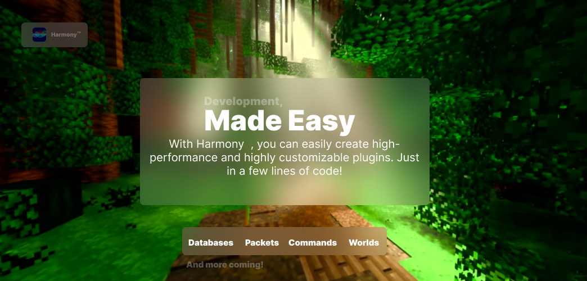

[](https://www.jitpack.io/#rodri-r-z/Harmony)




---

**Compatibility:**

- **< 1.7**: Is supported with packet listening for many features (i.e. chat system)
- **Spigot/Paper 1.8.x - 1.20.x**: Ensured and working without any problem
- **Folia**: Works fine. This includes a built-in way to use the Folia Scheduler without problems.
- **Any fork of Spigot/Paper** That doesn't change the API

---

**Features**

- Send colored messages to the console
- Cross-Platform support natively
- Automatically generate ALL necessary things for you
- Global scheduler working for all platforms without any problem
- String & String Validation Utility classes
- Built-In Database connector
- Support SQL & MongoDB with your plugin without coding them twice
- Make your plugin support from 1.8 (or even lower versions) to 1.20 
- Listen & send packets (optional)
- Command API
- GUI maker

---

**License**: [MIT License](./LICENSE.md)

© Rodrigo R. 

---

**Documentation**: Read the **Wiki** for documentation. 

[**Read JavaDoc**](https://works.brydget.net/harmony/docs/)

---

**Dependencies**: **You don't need to add any dependencies**  if you're working without packets and without databases. **However**:

- If you're using MongoDB, you'll need to add [The MongoDB Synchronous Driver](https://mvnrepository.com/artifact/org.mongodb/mongodb-driver-sync)
yourself into your `pom.xml` or `build.gradle` (or changing class path with the `MANIFEST.mf` file).
- If you're using packets, you'll need to add `ProtocolLib` as a dependence to your `plugin.yml`, like this:
  ```yaml
  depend: [ProtocolLib]
  ```
  Then you'll need to add the latest version of [ProtocolLib](https://github.com/dmulloy2/ProtocolLib/) into your `pom.xml` or `build.gradle`.

  For properly work, your final plugin will need ProtocolLib to be installed on the server to work.

---

**Example Plugin**: Here's an example plugin using Harmony

```java
package dev.rodrigo.greenshield;

import net.brydget.harmony.BackendPlugin;
import net.brydget.harmony.internal.PluginLogger;

public final class GreenShield extends BackendPlugin {

    @Override
    public void whenInitialize() {
        final PluginLogger logger = getOwnLogger();
        logger.info("&aHello world!");
        logger.info(
                isLegacy()
        );
    }

    @Override
    public void whenUnloaded() {
        // Plugin shutdown logic
    }
}
```

---

**Disclaimer:** The software is provided AS IS. I make serious efforts to make this work for you.
However, I'm not taking responsibility for ANY usage of it.